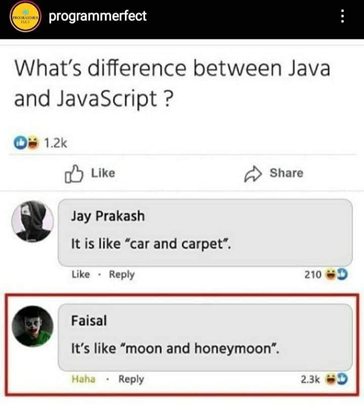

# JS Piscine

# JS 00

## basic rules

* The Node.JS version used by JS Piscine is LTS 14.x.
* The questions are arranged in ascending order of difficulty.
* Your code will be peer-reviewed, **so please make it easy for others to read** ! (For example, naming variables meaningfully or naming functions according to their functions.)
* For the problem of implementing a function, the function is imported via the module at evaluation time. Therefore, you need to export the function code to be submitted.
  - If there is only one function that needs to be implemented, it `default export` must be handled.
* Modules related to development such as **nodemon** and  **ESlint** must be `devdependencies` defined in .
* Before proceeding with the evaluation `npm install`, install all the pre-dependency modules through the command.
* `node_modules` Unnecessary files such as `.gitignore`.
* Although we do not evaluate the code format, it is recommended to proceed while checking the code format through eslint or beautify.
* **RTFM!**!
* Subjects are subject to change up to one hour before the submission deadline.
* If you find an error (a typo or logical error) in the issue, please post the issue in the [Github repository](https://github.com/issamelferkh/Piscine_JS). Your help makes JS Piscine more perfect :)

## before entering

Future JS basic subjects will be implemented and tested with a JS runtime called Node. You can use brew to install Node on a cluster machine. How do I install brew? Find #tools_bot in 42born2code Slack!

### [Exercise 00 - Hello JS!](ex00.md)
### [Exercise 01 - I don't know who you are, but bye!](ex01.md)
### [Exercise 02 - Things that don't change](ex02.md)
### [Exercise 03 - Time to change!](ex03.md)
### [Exercise 04 - Up, down, up, down, up, down, up, down, up, down](ex04.md)
### [Exercise 05 - Stacks made from arrays](ex05.md)
